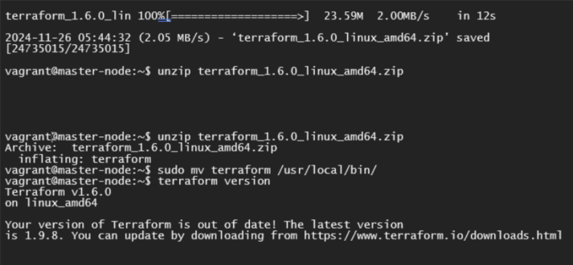
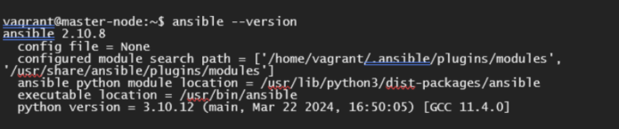
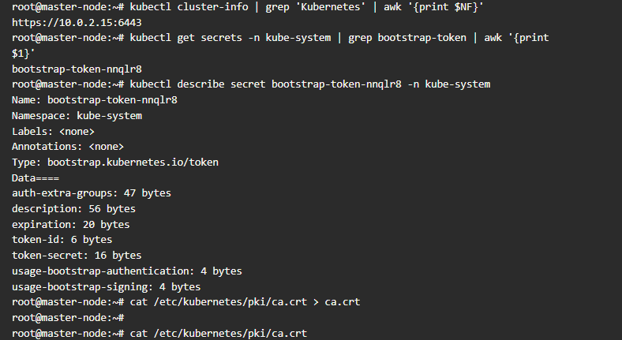
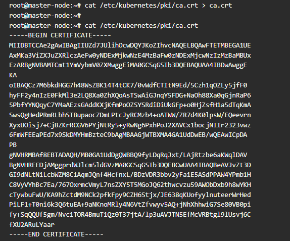
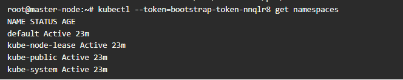
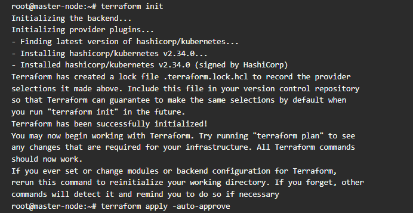
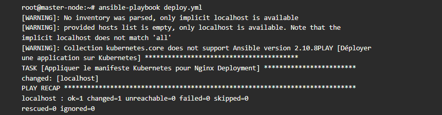

# Lab3: Application sur les notions de bases Terraform et Ansible


### Préparation de l' environnement
---

### Étape 1 :Installation de Terraform

1. Téléchargez Terraform:

```bash
wget https://releases.hashicorp.com/terraform/1.6.0/terraform_1.6.0_linux_amd64.zip
unzip terraform_1.6.0_linux_amd64.zip
sudo mv terraform /usr/local/bin/
```

2.  Vérifiez l'installation :

```bash
terraform version
```

### Capture d'écran

<div align="center">
  
  </div>

### Étape 2 : Installation d'Ansible

1.Installez Ansible:

```bash
sudo apt update && sudo apt install ansible -y
```

2. Vérifiez l'installation :

```bash
ansible --version
```

### Capture d'écran

<div align="center">
  
  </div>


### Étape 3 : Récupération des Valeurs des Variables

1. Variables nécessaires pour Terraform :

 - **KUBERNETES_API_ENDPOINT **

```bash
kubectl cluster-info | grep 'Kubernetes' | awk '{print $NF}'
```
 - **TOKEN **

```bash
kubectl get secrets -n kube-system | grep bootstrap-token | awk '{print $1}'
```
 - **PATH_TO_CA_CERT**

```bash
cat /etc/kubernetes/pki/ca.crt > ca.crt
```

### Captures d'écran

<div align="center">
  
  </div>
<div align="center">
  
  </div>
<div align="center">
  
  </div>


### Étape 4 : Utilisation de Terraform

1. Création d'un fichier `main.tf` :

```bash
resource "kubernetes_deployment" "nginx" {
  metadata {
    name = "nginx-deployment"
    namespace = kubernetes_namespace.example.metadata[0].name
  }
  spec {
    replicas = 2
    selector {
      match_labels = {
        app = "nginx"
      }
    }
    template {
      metadata {
        labels = {
          app = "nginx"
        }
      }
      spec {
        container {
          name = "nginx"
          image = "nginx:latest"
          port {
            container_port = 80
          }
        }
      }
    }
  }
}
```


### Déploiement avec Terraform
---
Déploiement  ressources Kubernetes avec Terraform

1.Execution des commandes :

```bash
terraform init
```
```bash
terraform apply -auto-approve
```

### Capture d'écran

<div align="center">
  
  </div>

### Utilisation d'Ansible

1.Execution des commandes :

```bash
ansible-playbook deploy.yml
```

### Capture d'écran

<div align="center">
  
  </div>

---


**Félicitations !** Playbook Executée.

