# Lab5:  ELK Stack

## Elasticsearch
---

###1 / Installation 

### Captures d'écran

  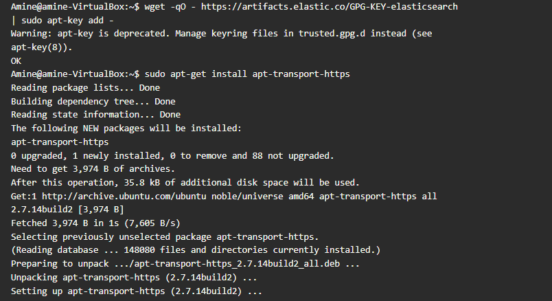
  

  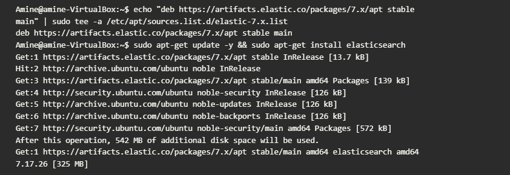
  

  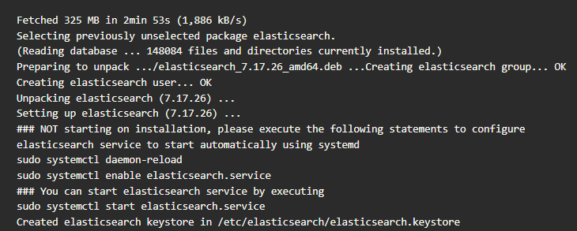
  

###2 / Lancement et test

### Captures d'écran

  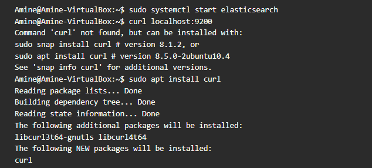
  

  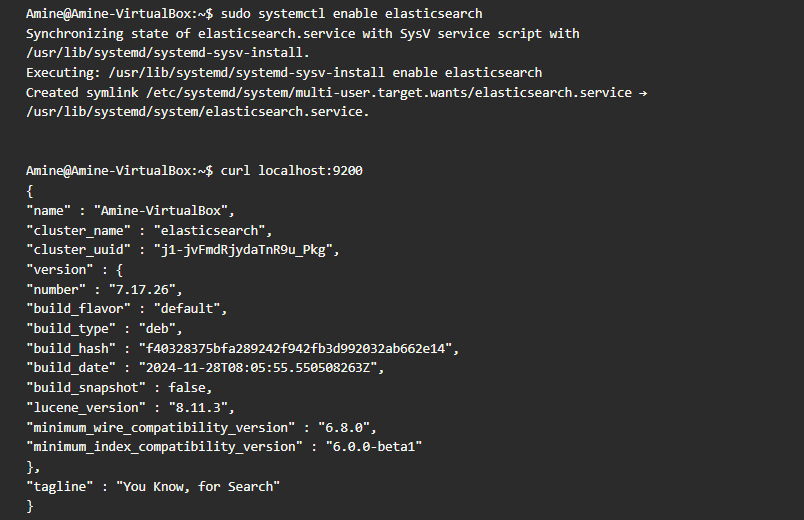
  

## Kibana
---

### 1/  Installation et lancement 

### Captures d'écran

  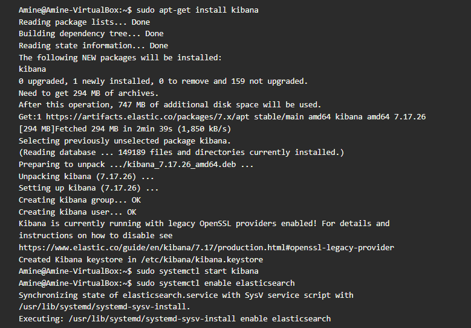
  

  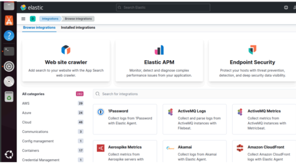
  

## Logstash
---

### 1/  Installation 

### Capture d'écran

  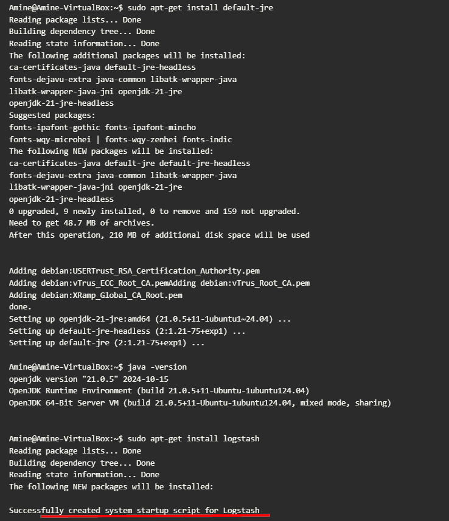
  

### 2/  Lancement et test

### Capture d'écran

  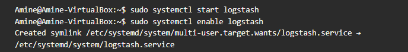
  

#Utilisation de la stack ELK sur les logs Apache
---

Après avoir installé la suite ELK nous allons pratiquer et s'initier à l'utilisation des différents
composants de la stack ELK en analysant en temps réel les logs d'accès Apache

1.utilisation du logstash :

### Capture d'écran

  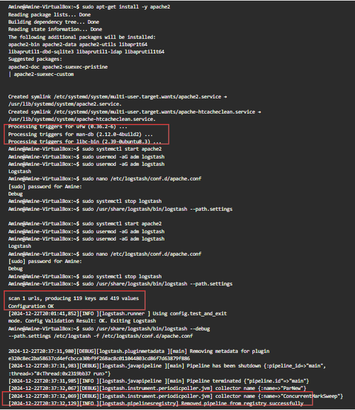
  

2.utilisation du ElasticSearch :

### Capture d'écran

  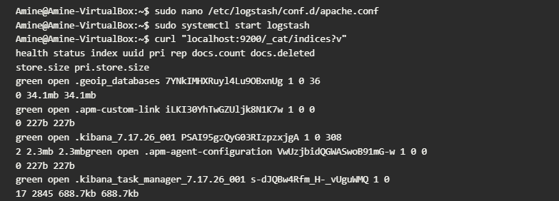
  

3.utilisation du Kibana:

### Capture d'écran

  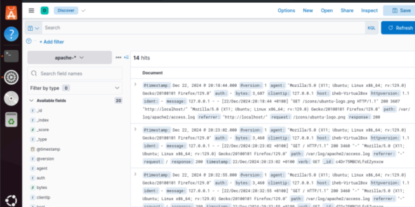
  

#Utilisation de Filebeat
---

1.Instalation et configuration :

### Capture d'écran

  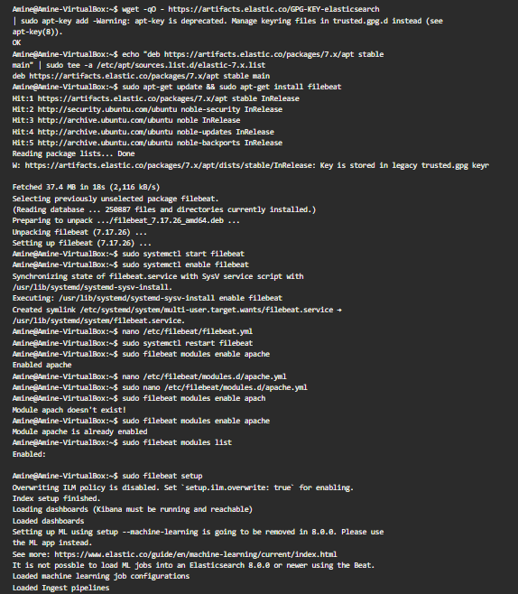
  

2.Test :

### Capture d'écran

  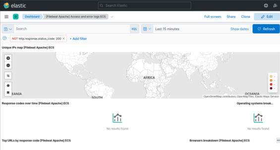
  

---

